# End-to-end user flows

The flows below compose the screen and transition inventories. Every flow has a Mermaid diagram; citations point to the implementation that performs the step.

### F-01 — First visit and session guard

Goal: First visit and session guard. Preconditions: route is reachable; API/mock session and data are available unless the flow explicitly tests failure.

Steps: 1. Visitor opens / — source src/app/page.tsx:1-5; src/app/(dashboard)/layout.tsx:15-23.
2. useSession — source src/app/page.tsx:1-5; src/app/(dashboard)/layout.tsx:15-23.
3. authenticated? — source src/app/page.tsx:1-5; src/app/(dashboard)/layout.tsx:15-23.
4. dashboard or login — source src/app/page.tsx:1-5; src/app/(dashboard)/layout.tsx:15-23.

Alternates/errors: loading skeletons remain until queries resolve; API errors use the screen notice/toast; empty/not-found paths use the nearest recovery link; safe redirect rejects empty or double-slash paths.

Screens/transitions: F-01 uses the relevant S screen and transition rows in 02-transition-inventory.md.

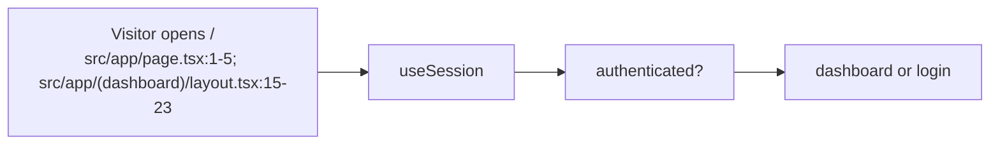
### F-02 — Sign up

Goal: Sign up. Preconditions: route is reachable; API/mock session and data are available unless the flow explicitly tests failure.

Steps: 1. /signup — source src/app/auth.tsx:229-264.
2. fill four fields — source src/app/auth.tsx:229-264.
3. Zod validation — source src/app/auth.tsx:229-264.
4. register — source src/app/auth.tsx:229-264.
5. safe redirect/dashboard — source src/app/auth.tsx:229-264.

Alternates/errors: loading skeletons remain until queries resolve; API errors use the screen notice/toast; empty/not-found paths use the nearest recovery link; safe redirect rejects empty or double-slash paths.

Screens/transitions: F-02 uses the relevant S screen and transition rows in 02-transition-inventory.md.

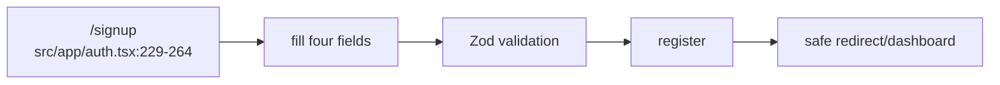
### F-03 — Login and redirect back

Goal: Login and redirect back. Preconditions: route is reachable; API/mock session and data are available unless the flow explicitly tests failure.

Steps: 1. Protected URL — source src/app/(dashboard)/layout.tsx:15-23; src/app/auth.tsx:18-116.
2. login?redirect — source src/app/(dashboard)/layout.tsx:15-23; src/app/auth.tsx:18-116.
3. credentials — source src/app/(dashboard)/layout.tsx:15-23; src/app/auth.tsx:18-116.
4. login — source src/app/(dashboard)/layout.tsx:15-23; src/app/auth.tsx:18-116.
5. safe return path — source src/app/(dashboard)/layout.tsx:15-23; src/app/auth.tsx:18-116.

Alternates/errors: loading skeletons remain until queries resolve; API errors use the screen notice/toast; empty/not-found paths use the nearest recovery link; safe redirect rejects empty or double-slash paths.

Screens/transitions: F-03 uses the relevant S screen and transition rows in 02-transition-inventory.md.

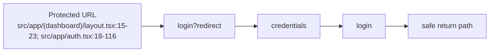
### F-04 — Wrong credentials and session expiry

Goal: Wrong credentials and session expiry. Preconditions: route is reachable; API/mock session and data are available unless the flow explicitly tests failure.

Steps: 1. Login submit — source src/app/auth.tsx:57-116; src/lib/api/client.ts:45-75.
2. API error — source src/app/auth.tsx:57-116; src/lib/api/client.ts:45-75.
3. inline error; protected API 401 — source src/app/auth.tsx:57-116; src/lib/api/client.ts:45-75.
4. login redirect — source src/app/auth.tsx:57-116; src/lib/api/client.ts:45-75.

Alternates/errors: loading skeletons remain until queries resolve; API errors use the screen notice/toast; empty/not-found paths use the nearest recovery link; safe redirect rejects empty or double-slash paths.

Screens/transitions: F-04 uses the relevant S screen and transition rows in 02-transition-inventory.md.

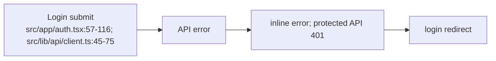
### F-05 — Logout

Goal: Logout. Preconditions: route is reachable; API/mock session and data are available unless the flow explicitly tests failure.

Steps: 1. Profile menu/settings — source src/app/shell.tsx:583-625; src/app/settings.tsx:670-707.
2. sign out confirmation — source src/app/shell.tsx:583-625; src/app/settings.tsx:670-707.
3. logout — source src/app/shell.tsx:583-625; src/app/settings.tsx:670-707.
4. clear cache — source src/app/shell.tsx:583-625; src/app/settings.tsx:670-707.
5. login — source src/app/shell.tsx:583-625; src/app/settings.tsx:670-707.

Alternates/errors: loading skeletons remain until queries resolve; API errors use the screen notice/toast; empty/not-found paths use the nearest recovery link; safe redirect rejects empty or double-slash paths.

Screens/transitions: F-05 uses the relevant S screen and transition rows in 02-transition-inventory.md.

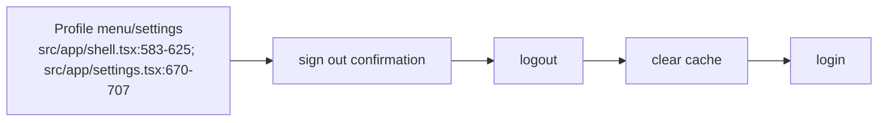
### F-06 — Add repository

Goal: Add repository. Preconditions: route is reachable; API/mock session and data are available unless the flow explicitly tests failure.

Steps: 1. Add repository — source src/app/repositories.tsx:383-735.
2. URL — source src/app/repositories.tsx:383-735.
3. validate — source src/app/repositories.tsx:383-735.
4. review metadata/permission — source src/app/repositories.tsx:383-735.
5. create — source src/app/repositories.tsx:383-735.
6. repository detail — source src/app/repositories.tsx:383-735.

Alternates/errors: loading skeletons remain until queries resolve; API errors use the screen notice/toast; empty/not-found paths use the nearest recovery link; safe redirect rejects empty or double-slash paths.

Screens/transitions: F-06 uses the relevant S screen and transition rows in 02-transition-inventory.md.

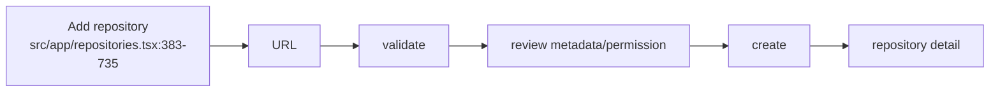
### F-07 — Repository review

Goal: Repository review. Preconditions: route is reachable; API/mock session and data are available unless the flow explicitly tests failure.

Steps: 1. Repository list/card — source src/app/repositories.tsx:71-345; src/app/repositories.tsx:737-1110.
2. repository detail — source src/app/repositories.tsx:71-345; src/app/repositories.tsx:737-1110.
3. tabs — source src/app/repositories.tsx:71-345; src/app/repositories.tsx:737-1110.
4. scans/findings/reports/external GitHub — source src/app/repositories.tsx:71-345; src/app/repositories.tsx:737-1110.

Alternates/errors: loading skeletons remain until queries resolve; API errors use the screen notice/toast; empty/not-found paths use the nearest recovery link; safe redirect rejects empty or double-slash paths.

Screens/transitions: F-07 uses the relevant S screen and transition rows in 02-transition-inventory.md.

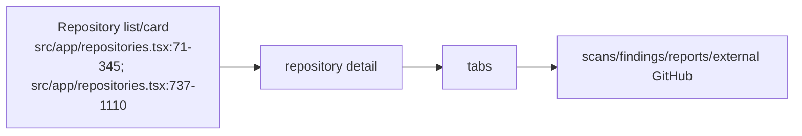
### F-08 — Start scan with branch

Goal: Start scan with branch. Preconditions: route is reachable; API/mock session and data are available unless the flow explicitly tests failure.

Steps: 1. Scan CTA — source src/app/components.tsx:716-866.
2. repository/branch selector — source src/app/components.tsx:716-866.
3. submit — source src/app/components.tsx:716-866.
4. queued scan detail — source src/app/components.tsx:716-866.

Alternates/errors: loading skeletons remain until queries resolve; API errors use the screen notice/toast; empty/not-found paths use the nearest recovery link; safe redirect rejects empty or double-slash paths.

Screens/transitions: F-08 uses the relevant S screen and transition rows in 02-transition-inventory.md.

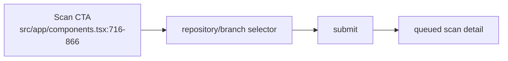
### F-09 — Scan progress/outcomes

Goal: Scan progress/outcomes. Preconditions: route is reachable; API/mock session and data are available unless the flow explicitly tests failure.

Steps: 1. Queued — source src/lib/api/hooks.ts:195-211; src/app/scans.tsx:327-727.
2. polling — source src/lib/api/hooks.ts:195-211; src/app/scans.tsx:327-727.
3. running — source src/lib/api/hooks.ts:195-211; src/app/scans.tsx:327-727.
4. completed clean/findings or failed — source src/lib/api/hooks.ts:195-211; src/app/scans.tsx:327-727.
5. detail/retry/report — source src/lib/api/hooks.ts:195-211; src/app/scans.tsx:327-727.

Alternates/errors: loading skeletons remain until queries resolve; API errors use the screen notice/toast; empty/not-found paths use the nearest recovery link; safe redirect rejects empty or double-slash paths.

Screens/transitions: F-09 uses the relevant S screen and transition rows in 02-transition-inventory.md.

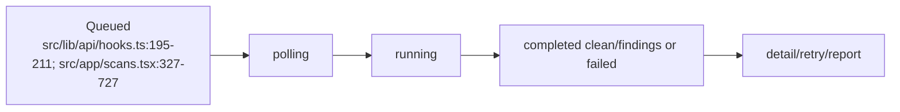
### F-10 — Scan history and rescan

Goal: Scan history and rescan. Preconditions: route is reachable; API/mock session and data are available unless the flow explicitly tests failure.

Steps: 1. Scans — source src/app/scans.tsx:46-323,327-445.
2. filters/search — source src/app/scans.tsx:46-323,327-445.
3. detail — source src/app/scans.tsx:46-323,327-445.
4. rescan dialog — source src/app/scans.tsx:46-323,327-445.
5. new scan — source src/app/scans.tsx:46-323,327-445.

Alternates/errors: loading skeletons remain until queries resolve; API errors use the screen notice/toast; empty/not-found paths use the nearest recovery link; safe redirect rejects empty or double-slash paths.

Screens/transitions: F-10 uses the relevant S screen and transition rows in 02-transition-inventory.md.

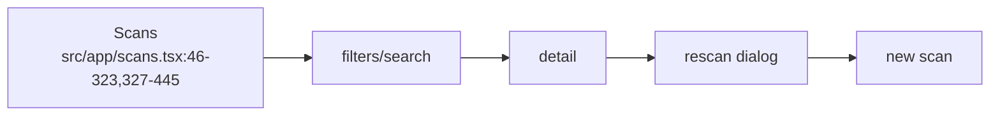
### F-11 — Findings triage

Goal: Findings triage. Preconditions: route is reachable; API/mock session and data are available unless the flow explicitly tests failure.

Steps: 1. Global/per-scan findings — source src/app/findings.tsx:80-555,560-1230.
2. filter/sort/page — source src/app/findings.tsx:80-555,560-1230.
3. detail — source src/app/findings.tsx:80-555,560-1230.
4. status dialog — source src/app/findings.tsx:80-555,560-1230.
5. update — source src/app/findings.tsx:80-555,560-1230.

Alternates/errors: loading skeletons remain until queries resolve; API errors use the screen notice/toast; empty/not-found paths use the nearest recovery link; safe redirect rejects empty or double-slash paths.

Screens/transitions: F-11 uses the relevant S screen and transition rows in 02-transition-inventory.md.

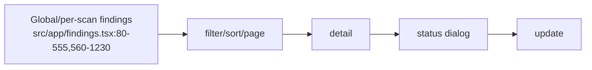
### F-12 — PDF report

Goal: PDF report. Preconditions: route is reachable; API/mock session and data are available unless the flow explicitly tests failure.

Steps: 1. Scan/report CTA — source src/app/reports.tsx:200-365; src/app/components.tsx:866-905.
2. generate — source src/app/reports.tsx:200-365; src/app/components.tsx:866-905.
3. generating/poll — source src/app/reports.tsx:200-365; src/app/components.tsx:866-905.
4. ready — source src/app/reports.tsx:200-365; src/app/components.tsx:866-905.
5. download PDF or failed/retry — source src/app/reports.tsx:200-365; src/app/components.tsx:866-905.

Alternates/errors: loading skeletons remain until queries resolve; API errors use the screen notice/toast; empty/not-found paths use the nearest recovery link; safe redirect rejects empty or double-slash paths.

Screens/transitions: F-12 uses the relevant S screen and transition rows in 02-transition-inventory.md.

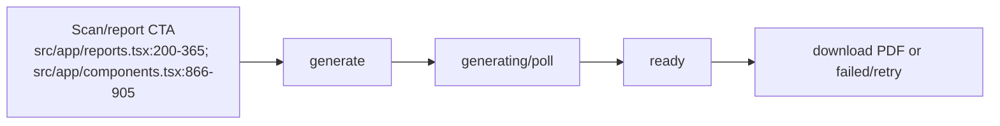
### F-13 — Dashboard overview

Goal: Dashboard overview. Preconditions: route is reachable; API/mock session and data are available unless the flow explicitly tests failure.

Steps: 1. Dashboard — source src/app/dashboard.tsx:51-432.
2. KPI/severity/recent activity/repository card — source src/app/dashboard.tsx:51-432.
3. contextual destination — source src/app/dashboard.tsx:51-432.

Alternates/errors: loading skeletons remain until queries resolve; API errors use the screen notice/toast; empty/not-found paths use the nearest recovery link; safe redirect rejects empty or double-slash paths.

Screens/transitions: F-13 uses the relevant S screen and transition rows in 02-transition-inventory.md.

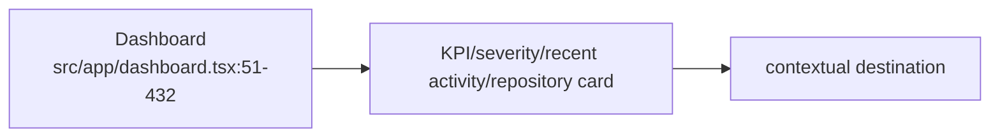
### F-14 — Settings

Goal: Settings. Preconditions: route is reachable; API/mock session and data are available unless the flow explicitly tests failure.

Steps: 1. Settings — source src/app/settings.tsx:101-840.
2. profile/password/GitHub/notifications/demo — source src/app/settings.tsx:101-840.
3. API mutation or local presentation — source src/app/settings.tsx:101-840.

Alternates/errors: loading skeletons remain until queries resolve; API errors use the screen notice/toast; empty/not-found paths use the nearest recovery link; safe redirect rejects empty or double-slash paths.

Screens/transitions: F-14 uses the relevant S screen and transition rows in 02-transition-inventory.md.

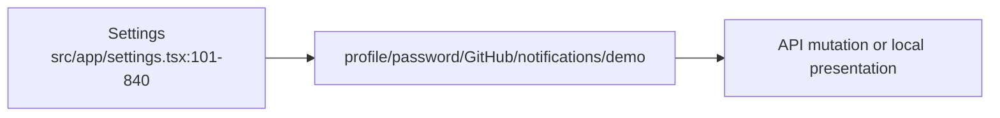
### F-15 — Help and recovery

Goal: Help and recovery. Preconditions: route is reachable; API/mock session and data are available unless the flow explicitly tests failure.

Steps: 1. Help/empty/error/not-found — source src/app/(dashboard)/help/page.tsx; src/app/error.tsx:1-17.
2. guidance or dashboard/repository recovery — source src/app/(dashboard)/help/page.tsx; src/app/error.tsx:1-17.

Alternates/errors: loading skeletons remain until queries resolve; API errors use the screen notice/toast; empty/not-found paths use the nearest recovery link; safe redirect rejects empty or double-slash paths.

Screens/transitions: F-15 uses the relevant S screen and transition rows in 02-transition-inventory.md.

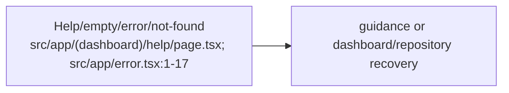
## Global site map

```mermaid
flowchart TD
root[/] --> auth[/login]
root --> dashboard[/dashboard]
auth --> signup[/signup]
signup --> dashboard
dashboard --> repos[/repositories]
dashboard --> scans[/scans]
dashboard --> findings[/findings]
dashboard --> reports[/reports]
dashboard --> settings[/settings]
dashboard --> help[/help]
repos --> newrepo[/repositories/new]
repos --> repodetail[/repositories/:id]
repodetail --> reposcan[/repositories/:id/scan]
repodetail --> scan[/scans/:id]
repodetail --> report[/reports/:id]
scans --> scan
scan --> scanfindings[/scans/:id/findings]
scanfindings --> finding[/scans/:id/findings/:findingId]
findings --> finding
reports --> report
report --> scan
settings --> repos
help --> newrepo
```

## Navigation map

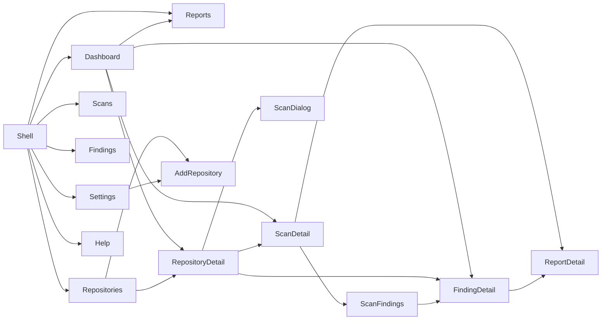

## Dead ends called out by implementation

- The forgot-password UI is only a preview and does not call the reset service (src/app/auth.tsx:167-207).
- The scan cancel control is visibly disabled (src/app/scans.tsx:681-687).
- Report retry currently changes demo state rather than calling a dedicated generation retry (src/app/reports.tsx:246-251).
- The report screen has no embedded PDF iframe/object preview; download is the available ready-state action (src/app/components.tsx:866-905).

